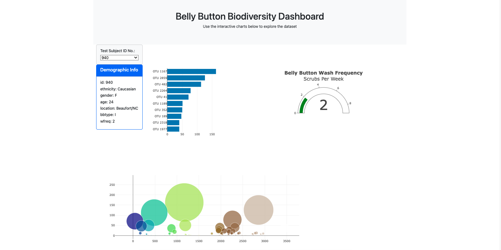

# Bellybutton Dashboard

## Website: 
[website](https://hasmigg.github.io/belly-button-challenge/)

## Description
Provides biodiversity information on OTUs found in bellybuttons.

## Table of Contents
- [Installation](#installation)
- [Usage](#usage)
- [Credits](#credits)
- [License](#license)
- [Features](#features)

- [Contact](#contact)

## Installation
html, bootstrap, javascript, D3

## Usage
Render the Dashboard on the browser

## Credits
Hasmig Gregorian

## License
MIT

## Features
Horizontal bar chart, bubble chart, and a gauge.

## Contact
If there are any questions of concerns, I can be reached at:
##### [github: HasmigG](https://github.com/HasmigG)
##### [email: hasmigg23@gmail.com](mailto:hasmigg23@gmail.com)
